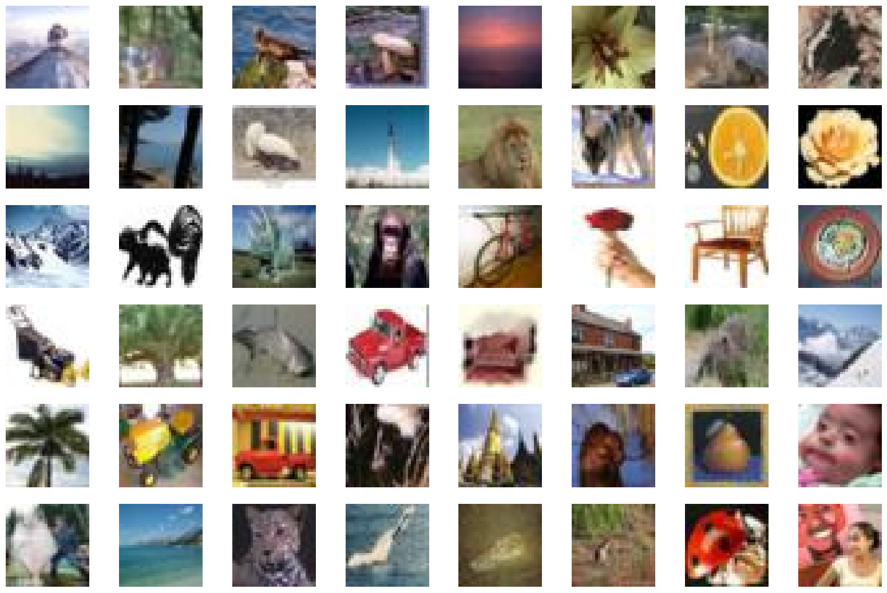
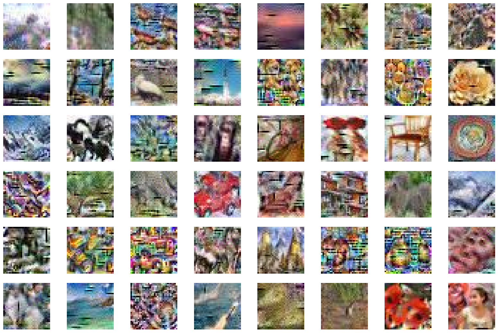
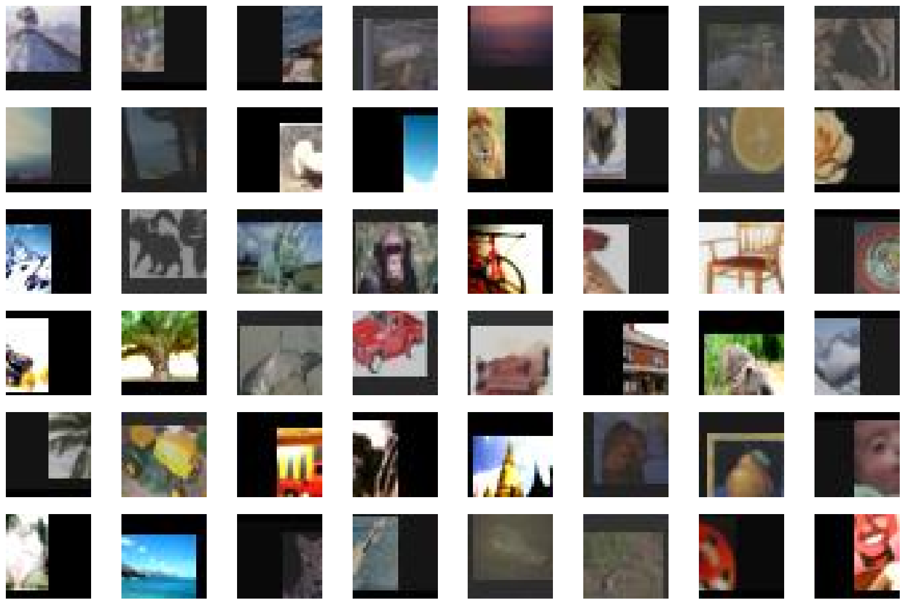
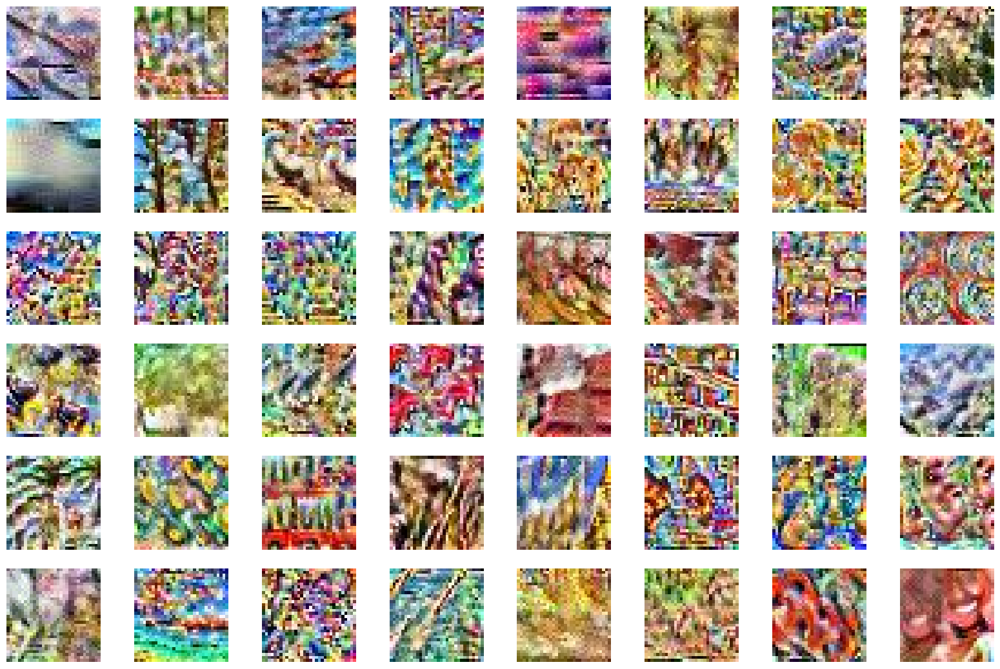

# Privacy-preserving Collaborative Learning with Automatic Transformation Search

This repository is an implementation of the privacy-preserving algorithm discussed in
```
Privacy-preserving Collaborative Learning with Automatic Transformation Search
```
which can be found at https://arxiv.org/abs/2011.12505
<p align="center">
    
</p>


### Abstract
Collaborative learning has gained great popularity due to its benefit of data privacy protection: participants can jointly train a Deep Learning model without sharing their training sets. However, recent works discovered that an adversary can fully recover the sensitive training samples from the shared gradients. Such reconstruction attacks pose severe threats to collaborative learning. Hence, effective mitigation solutions are urgently desired.
In this paper, we propose to leverage data augmentation to defeat reconstruction attacks: by preprocessing sensitive images with carefully-selected transformation policies, it becomes infeasible for the adversary to extract any useful information from the corresponding gradients. We design a novel search method to automatically discover qualified policies. We adopt two new metrics to quantify the impacts of transformations on data privacy and model usability, which can significantly accelerate the search speed. Comprehensive evaluations demonstrate that the policies discovered by our method can defeat existing reconstruction attacks in collaborative learning, with high efficiency and negligible impact on the model performance.

## Code
The search algorithm file that contains  can be found at ```searchalg/```. The other important experimental part can be found at ```benchmark/```.

## Setup
You can use [anaconda](https://www.anaconda.com/distribution/) to install our setup by running
```
conda env create -f environment.yml
conda activate ats
```


## Quick Start 
### Step1 Download Key Files and put it in correct checkpoints folder with name checkpoints/tiny_data_FashionMinist_arch_ResNet20-4FashionMinist/
```
python train_tinymodel_mnist.py
```


### Step2 Automatic Transformation Search
```
# download a tiny_data trained network for search 
python -u searchalg/batch_generate.py  --arch=ResNet20-4FashionMinist --data=FashionMinist > batch_generate.sh
bash batch_generate.sh
python -u searchalg/search_best.py --arch=ResNet20-4FashionMinist --data=FashionMinist
```

### Step3 Privacy-Perserving Evaluation
Get the correct functions, this file has not been updated for FashionMnist but with the changes in the command lines as above, it will work.
```
bash benchmark/run/benchmark_attack.sh
```

### Visualize Result
Input Image             |  Reconstruction from Inverting Gradients
:-------------------------:|:-------------------------:
  |  

Transformed Image             |  Reconstruction from Inverting Gradients
:-------------------------:|:-------------------------:
  |  

[Model: standard ResNet20, trained on cifar100 data. The image is from the validation set.]


# Acknowledgement 
We express gratitudes to the great work [Inverting Gradients](https://github.com/JonasGeiping/invertinggradients) and [DLG](https://github.com/mit-han-lab/dlg) as we benefit a lot from both their papers and codes.

# License
This repository is released under the MIT license. 
